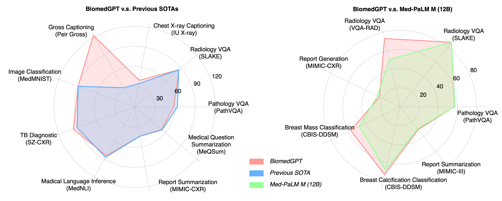

<!---
Copyright 2022 The OFA-Sys Team. 
Copyright 2023 Kai Zhang @ Lehigh. 
All rights reserved.
This source code is licensed under the Apache 2.0 license found in the LICENSE file in the root directory.
-->

# BiomedGPT
[BiomedGPT](https://arxiv.org/abs/2305.17100) is developed based on [OFA](https://github.com/OFA-Sys/OFA) but pre-trained and fine-tuned with multi-modal & multi-task biomedical datasets. Details are shown in [datasets.md](datasets.md). If you have any questions, feel free to contact us or post issues. 

Breaking News! 💥 :

We have updated the fine-tuning receipts to to match or surpass the performance of prior state-of-the-art models, including Med-PaLM M (12B) and GPT-4V. For more details, please refer to the corresponding preprint version was updated. Below is a snapshot comparing these performances.

<p align="center">
    <br>
    
    <br>
<p>

- [] We're updating our codebase and will soon release the latest SOTA checkpoints for various downstream tasks.
- [] Efforts are underway to translate our code **from fairseq to Hugging Face**, simplifying usage for users.
<br></br>


# Checkpoints
We provid pretrained checkpoints of BiomedGPT (<a href="https://www.dropbox.com/sh/cu2r5zkj2r0e6zu/AADZ-KHn-emsICawm9CM4MqVa?dl=0">Dropbox</a>), which can be put in the `scripts/` folder for further development. For finetuned checkpoints, please refer to [checkpoints.md](checkpoints.md). 
## Note:
I recently received a reminder regarding potential policy issues associated with releasing the model checkpoints, due to the fact that not all pretraining / downstream datasets are fully open-sourced. I need to review the relevant policies and licenses to ensure the legality of sharing the weights. Once I can confirm this, I will enable downloading the checkpoints. Thank you for your patience.

<br></br>

# Installation
```bash
git clone https://github.com/taokz/BiomedGPT
conda env create -f biomedgpt.yml
python -m pip install pip==21.2.4
pip install fairseq
```
<br></br>


# Implementation
We provide the preprocessing, pretraining, finetuning and inference scripts in the `scripts/` folder. You can follow the directory setting below:

```
BiomedGPT/
├── checkpoints/
├── datasets/
│   ├── pretraining/
│   ├── finetuning/
│   └── ...
├── scripts/
│   ├── preprocess/
│   │   ├── pretraining/
│   │   └── finetuning/
│   ├── pretrain/
│   ├── vqa/
│   └── ...
└── ...
```

## Pretraining
Please follow [datasets.md](datasets.md) to prepare pretraining datasets, which includes 4 TSV files: <code>vision_language.tsv</code>, <code>text.tsv</code>, <code>image.tsv</code> and <code>detection.tsv</code> in the directory of `./datasets/pretraining/`.

<pre>
cd scripts/pretrain
bash pretrain_tiny.sh
</pre>
Feel free to modify the hyperparameters in the bash script for your requirements or ablation study.
<br></br>

## Downstreams
We provide the run scripts of fine-tuning and inference. There will be log files during execution. Before fine-tuning or inference, please refer to 
<details>
    <summary><b>Visual Question Answering</b></summary>
<pre>
cd scripts/vqa
# for fine-tuning
bash train_vqa_rad_beam.sh
# for inference
bash evaluate_vqa_rad_beam.sh
</pre>
</details>
<details>
    <summary><b>Image Captioning</b></summary>
<pre>
cd scripts/caption
# for fine-tuning
bash train_peir_gross.sh
# for inference
bash evaluate_peir_gross.sh
</pre>
</details>
<details>
    <summary><b>Text Summarization</b></summary>
<pre>
cd scripts/text_sum
# for fine-tuning
bash train_meqsum.sh
# for inference
bash evaluate_meqsum.sh
</pre>
</details>
<details>
    <summary><b>Natural Language Inference</b></summary>
<pre>
cd scripts/mednli
# for fine-tuning
bash train_mednli.sh
# for inference
bash evaluate_mednli.sh
</pre>
</details>
<details>
    <summary><b>Image Classification</b></summary>
<pre>
cd scripts/image_cls
# for fine-tuning: I provide a template, please set different hyparameters for each dataset in MedMNIST if required.
bash train_medmnist.sh 
# for inference: a template
bash evaluate_medmnist.sh
</pre>
</details>

<br></br>

# Related Codebase
* [OFA](https://github.com/OFA-Sys/OFA)
* [Fairseq](https://github.com/pytorch/fairseq)
* [taming-transformers](https://github.com/CompVis/taming-transformers)
* [self-critical.pytorch](https://github.com/ruotianluo/self-critical.pytorch)
<br></br>


# Citation
If you use BiomedGPT model or our code for publications, please cite 🤗: 
```
@misc{zhang2023biomedgpt,
      title={BiomedGPT: A Unified and Generalist Biomedical Generative Pre-trained Transformer for Vision, Language, and Multimodal Tasks}, 
      author={Kai Zhang and Jun Yu and Zhiling Yan and Yixin Liu and Eashan Adhikarla and Sunyang Fu and Xun Chen and Chen Chen and Yuyin Zhou and Xiang Li and Lifang He and Brian D. Davison and Quanzheng Li and Yong Chen and Hongfang Liu and Lichao Sun},
      year={2023},
      eprint={2305.17100},
      archivePrefix={arXiv},
      primaryClass={cs.CL}
}
```
<br></br>
